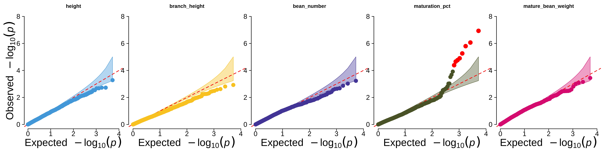

# RAD-Seq genotyping of guar (*C. tetragonoloba*)

Repository containing data and code for the guar (*Cyamopsis tetragonoloba* (L.) Taub.) genotyping and GWAS project. A brief description of the repository contents:

`make_consensus_vcf.py` script was used to generate the final variant dataset using raw GATK-HC, NGSEP and TASSEL 5 variant calls, `make_snp_stats.py` script was used with the same inputs to explore the quality statistics of the variant calls.

`callset_refinement_filtering.ipynb` notebook was used to run variant quality control and construct the final filtered dataset of common variaants.

`genetic_analysis.ipynb` notebook was used to perform most of the genetic analyses, including PCA, linkage disequilibrium analysis, and generalized linear model-based association analysis.

`prepare_farmcpu.py` script was used to format input data for FarmCPU tool (Q-Q plot of the resulting p-values is shown in the paper and below).

`admix_file_create.py` file was used to preprocess genotypes for ADMIXTURE analysis (part of this was done using Hail in the `genetic_analysis.ipynb`).

`guar_stat.R` script was used to run statistical analysis of the final data, conduct genome-wide association analysis using the FarmCPU tool, and plot main figures

`parse_vcf_fcpu.py` script was used to format the final SNP genotype table available as the `genotypes.xlsx` file in this repository.

